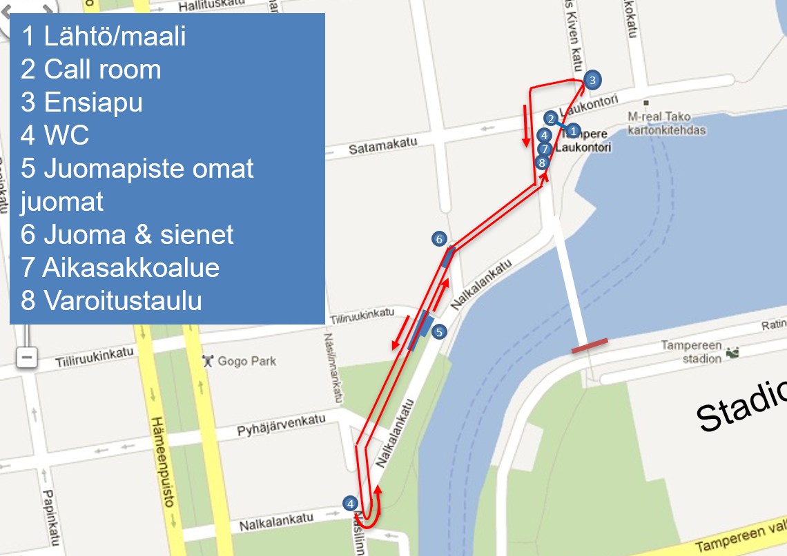

# Kävelykilpailujen järjestelyt

Tässä osiossa tarkastellaan kilpailunjärjestäjän vastuulle kuuluvia seikkoja kävelykilpailun järjestämisessä. 

## Tarvittavat henkilöt

- Kilpailujen johtaja
- Lajijohtaja
- Toimitsijat
- Kävelytuomarit
- Järjestyksen valvojat/reitin valvojat
- Lääkintähenkilöt

## Vastuunjako

| Lajinjohtajan vastuualueet                                                             | Kävelyjen ylituomarin vastuualueet                          |
| -------------------------------------------------------------------------------------- | ----------------------------------------------------------- |
| Toimitsijat                                                                            | Tuomaripalaverit                                            |
| Ajanotto                                                                               | Kävelytuomareiden sijoittelu                                |
| Kierroslasku                                                                           | Hylkäykset kävelysäännön TR 54.7 mukaisesti                 |
| Ajanottorajojen valvonta                                                               | Aikasakkosäännön valvonta ja urheilijoiden ohjaus alueelle. |
| Rata/reittivalvonta (ratarikot, reitiltä poistumiset, juoma-asemien valvonta)          | Varoitustaulun käytön valvonta                              |
| Juoma- ja sieniasemien varustelu ja toiminta                                           | Kävelytuomaripöytäkirjan laadinta                           |
| Reitin turvallisuus                                                                    | Tulosten tarkistus (hylätyt urheilijat, aikasakot)          |
| Tulosten tarkistus ja hyväksyntä (DNF, DQ merkinnät ja mahdolliset aikasakkolisäykset) |                                                             |

## Tuomareiden lukumäärä

Ratakilpailuissa on normaalisti 5 tuomitsevaa tuomaria sekä ylituomari.

Maantiekilpailuissa on normaalisti 5-8 tuomitsevaa tuomaria sekä ylituomari. Tuomarien määrän määrittämisessä on huomioitava reitin muoto ja pituus. 

### Tuomarit SM-kisoissa

SUL:n kilpailuvaliokunta nimeää ylituomarin kaikkiin SM-kisoihin. 

Kilpailunjärjestäjä hankkii muut tuomarit. Suositus on nimetä heidät SUL:n kävelytuomaripaneelista. 

Mestaruuskilpailusääntöjen mukaan:

- Vähintään puolet tuomareista (ylituomari mukaan lukien) on oltava SUL:n kilpakävelytuomaripaneelista (tai kansainvälisiä tuomareita).
- Yleisen sarjan SM-kisojen kävelykilpailut on järjestettävä WA:n ranking-kilpailuina. Tällöin vähintään kolmen tuomitsevan tuomarin on oltava kansainvälisiä tuomareita, jotta kisa olisi ranking-kelpoinen. 
 
## Kävelytuomarin varusteet

{ align=right }

- Tunniste (esim. lakki, hihanauha, merkki, toimitsija-asu)
- Pöytäkirjat
- Huomautuslaikat
- Varoituskortit
- Kirjoitusalusta, kynät
- Reittikartta
- Osallistujaluettelo
- Tarvittaessa sadevarusteet 
- Pitkissä tuomaritehtävissä saatavilla juotavaa ja ravintoa

## Aikasakkoalueen käyttö Suomessa

- Kaikissa kansainvälisissä kilpailuissa
- SM-kilpailuissa lukuun ottamatta SM-viestejä ja sisähallikilpailuja.
- Kolme punaista => urheilija aikasakkoalueelle
- Kävelyjen ylituomari tai hänen valtuuttamansa henkilö (ylituomarin apulainen/ muu nimetty toimitsija) vastaa ohjauksesta alueelle

## Aikasakkoalue

- Rajattu alue n. 80 m ennen maalia mikäli mahdollista (erotetaan kartioilla, aidoilla tms. tavalla)
- 10 m pitkä, ratakävelyissä radat 5-7, maantiekävelyssä leveys määräytyy reitti huomioon ottaen
- Sisäänkäynti ja uloskäynti alueen päätyihin.

### Aikasakkoalueen toimitsijat ja tehtävät

- Kaksi toimitsijaa
- Ylituomarin apulainen
- Aikasakon ajanotto
- Kirjataan urheilijan tuloaika ja lähtöaika
- Ilmoitus urheilijalle 10 sek. ennen aikasakon päättymistä

### Aikasakot

| Matkaan asti sisältäen ko. matkan | aikasakko |
| --------------------------------- | --------- |
| 5000m/5km tai alle                | 30 sek.   |
| 10000m/10km                       | 1 min     |
| 20000m/20km                       | 2 min     |
| 35000m/35km                       | 3,5 min   |
| 50000m/50km                       | 5 min     |

## Lähetit

- tuomarin henkilökohtainen lähetti 
- polkupyörälähetti

## Varoitustaulu

- elektroninen tai manuaalinen
- sarakkeet urheilijan numerolle sekä neljälle “punaiselle”
- varoituksen syy merkittävä

{: style="width: 50%"}

## Maantiereitti

- Reitin pituus 1-2 km
- WA:n A -tai B-mittaajan mittaama (tilastokelpoinen tulos)
- Kääntöpaikat: suositushalkaisija 7 m, minimi 5 m.
- Tasainen ( ei kaivoja, korokkeita eikä hiekkaa)
- Riittävän leveä 
    - tilaa varoitustaululle, aikasakkoalueelle, tuomareille, juoma- ja sieniasemille, ajanottajille, kierroslaskijoille, lääkintähuollolle

## Juoma, sieni- ja virvokeasemat

Vettä (ja muita sopivia virvokkeita) tulee olla saatavilla kaikkien kilpailujen lähdössä ja maalissa.

Kilpailuissa, joiden pituus on 5-10km tulee olla vain vettä tarjoavia juoma- ja sieniasemia sopivin välein, _jos sääolosuhteet sitä edellyttävät_.

Kilpailuissa, joiden pituus on yli 10 km, tulee olla asetettuna virvokeasema kävelyreitin jokaisella kierroksella. Vesi- ja sieniasemia tulee lisäksi sijoittaa aina suunnilleen virvokeasemien puoliväliin tai jopa tiheämmin, jos sääolosuhteet sitä edellyttävät. 

Virvokkeet voivat olla joko urheilijoiden omia tai järjestäjien tarjoamia. Vain valtuutetut henkilöt voivat ojentaa juomat.

|                          | alle 5000m | __5000-10000m/5-10km__ | __yli 10000m/10km__    |
| :-------------------     | :--------: | :--------------------: | :--------------------: |
| __vesi- ja sieniasemat__ | ei         | olosuhteiden vaatiessa | olosuhteiden vaatiessa |
| __virvokeasemat__        | ei         | ei                     | oltava                 |

Myös radalla suoritettavissa kilpailuissa tulee tarvittaessa käyttää virvokeasemaa. Aseman sijoituspaikka takasuoralla 3-4 radoilla.

Kilpailijoiden suoritus tulee hylätä, jos hän ottaa virvokkeita muualla kuin virallisella virvokeasemilla. Hylkäyksen suorittaa lajinjohtaja.

Toimihenkilö ei saa koskaan juosta (tai kävellä) kilpailijan vierellä tämän nauttiessa virvokkeitaan.

## Reitiltä poistuminen

Virallisen toimihenkilön valvonnassa ja  luvalla

Mikäli käveltävää matkaa lyhennetään tai poistutaan luvattomasti reitiltä on kilpailija hylättävä. Hylkäyksen suorittaa lajinjohtaja.

## Turvallisuus kilpailuissa

Kävelykilpailujen järjestäjien on varmistettava kilpailijoiden turvallisuus. 

Reitti tulisi sulkea mahdollisuuksien mukaan muulta liikenteeltä ja minimoida läpikulkuliikenne reitillä.

Reitin varrella oltava riittävästi liikenteen ja reitin valvojia.

Varmistettava myös lääkintähenkilökunnan paikallaolo.

