# Kävelykilpailujen järjestelyt

## Tarvittavat henkilöt

- Kilpailujen johtaja
- Lajijohtaja
- Toimitsijat
- Kävelytuomarit
- Järjestyksen valvojat/reitin valvojat
- Lääkintähenkilöt

## Lajinjohtajan vastuualueet

- Toimitsijat 
- Ajanotto
- Kierroslasku
- Ajanottorajojen valvonta
- Rata/reittivalvonta (ratarikot, reitiltä poistumiset, juoma-asemien valvonta)
- Juoma- ja sieniasemien varustelu ja toiminta
- Reitin turvallisuus
- Tulosten tarkistus ja hyväksyntä (DNF, DQ merkinnät ja mahdolliset aikasakkolisäykset)

## Kävelyjen ylituomarin vastuualueet

- Tuomaripalaverit
- Kävelytuomareiden sijoittelu
- Hylkäykset kävelysäännön TR 54.7mukaisesti
- Aikasakkosäännön valvonta ja urheilijoiden ohjaus alueelle. 
- Varoitustaulun käytön valvonta
- Kävelytuomaripöytäkirjan laadinta
- Tulosten tarkistus (hylätyt urheilijat, aikasakot)

## Tuomareiden lukumäärä

- Ratakilpailut; 5+ylituomari
- Maantiekilpailut; 5-8+ylituomari (reitin muoto ja pituus huomioitava)
- SM-kisoissa
  - kävelyn ylituomari SUL:n kilpailuvaliokunnan nimeämä
  - Muut tuomarit kävelytuomaripaneelista (suositus)

## Kävelytuomarin varusteet

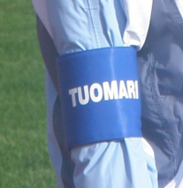{ align=right }

- Tunniste (esim. lakki, hihanauha, merkki, toimitsija-asu)
- Pöytäkirjat
- Huomautuslaikat
- Varoituskortit
- Kirjoitusalusta, kynät
- Reittikartta
- Osallistujaluettelo
- Tarvittaessa sadevarusteet 
- Pitkissä tuomaritehtävissä saatavilla juotavaa ja ravintoa

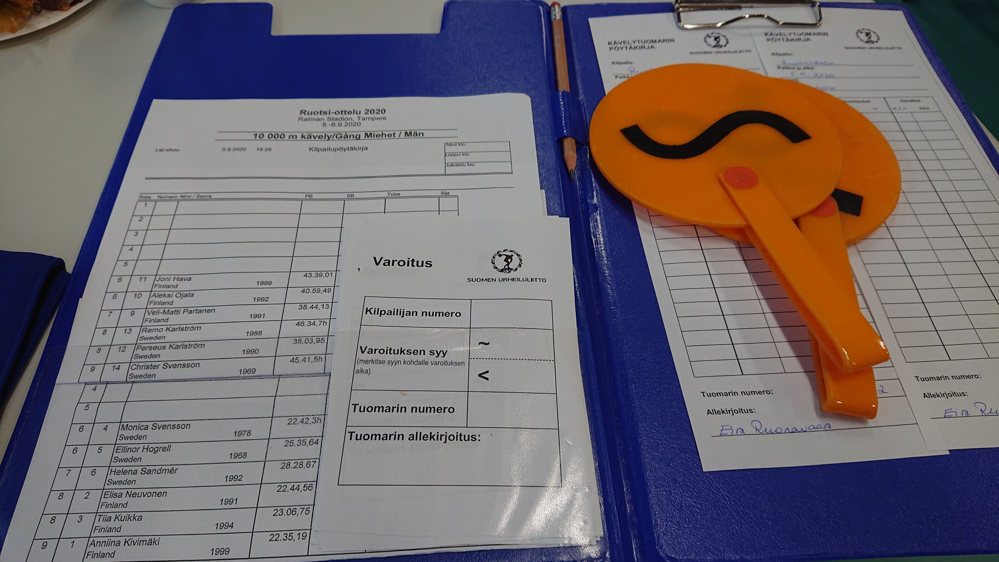

## Aikasakkoalueen käyttö Suomessa

- Kaikissa kansainvälisissä kilpailuissa
- SM-kilpailuissa lukuun ottamatta SM-viestejä ja sisähallikilpailuja.
- Kolme punaista => urheilija aikasakkoalueelle
- Kävelyjen ylituomari tai hänen valtuuttamansa henkilö (ylituomarin apulainen/ muu nimetty toimitsija) vastaa ohjauksesta alueelle

## Aikasakkoalue

- Rajattu alue n. 80 m ennen maalia mikäli mahdollista (erotetaan kartioilla, aidoilla tms. tavalla)
- 10 m pitkä, ratakävelyissä radat 5-7, maantiekävelyssä leveys määräytyy reitti huomioon ottaen
- Sisäänkäynti ja uloskäynti alueen päätyihin.

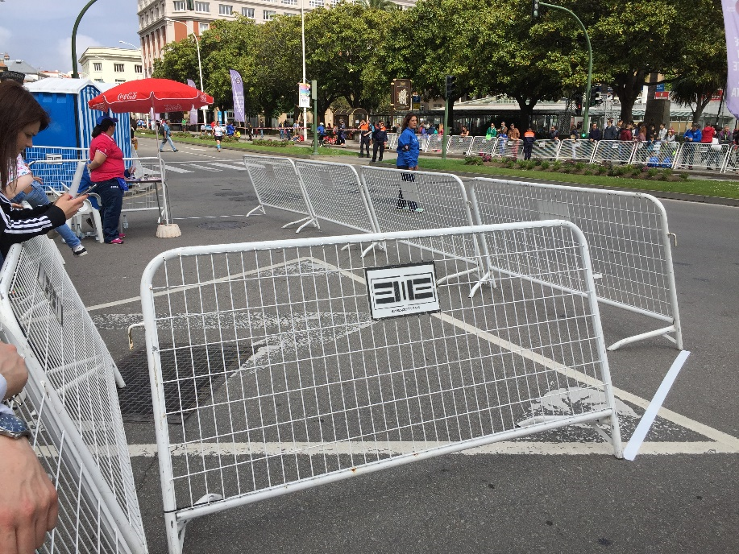

### Tarvittavat toimitsijat ja tehtävät

- Kaksi toimitsijaa
- Ylituomarin apulainen
- Aikasakon ajanotto
- Kirjataan urheilijan tuloaika ja lähtöaika
- Ilmoitus urheilijalle 10 sek. ennen aikasakon päättymistä

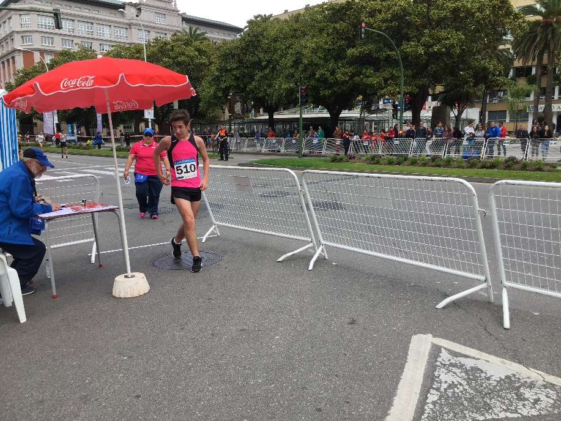
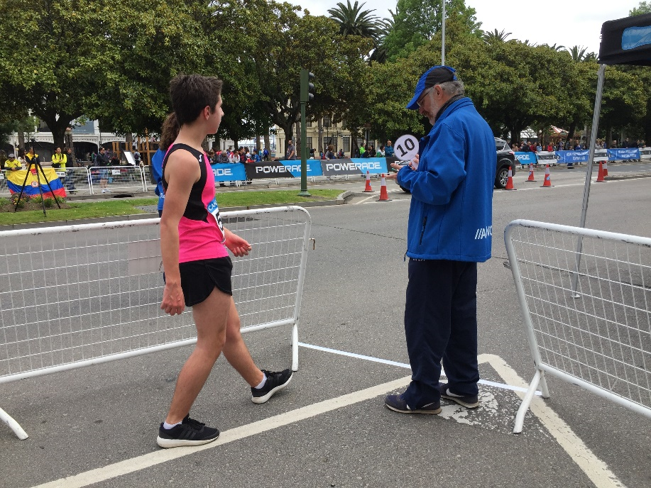

### Aikasakot

| Matkaan asti sisältäen ko. matkan | aikasakko |
| --------------------------------- | --------- |
| 5000m/5km tai alle                | 30 sek.   |
| 10000m/10km                       | 1 min     |
| 20000m/20km                       | 2 min     |
| 35000m/35km                       | 3,5 min   |
| 50000m/50km                       | 5 min     |

## Lähetit

- tuomarin henkilökohtainen lähetti 
- polkupyörälähetti

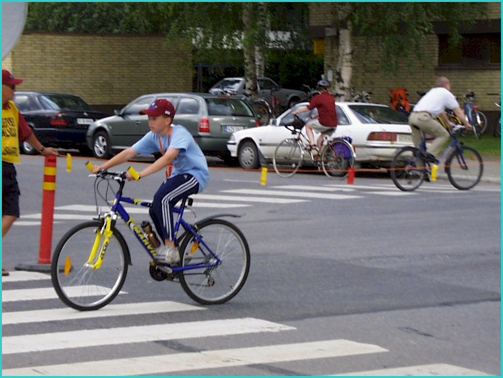

## Varoitustaulu

- elektroninen tai manuaalinen
- sarakkeet urheilijan numerolle sekä neljälle “punaiselle”
- varoituksen syy merkittävä

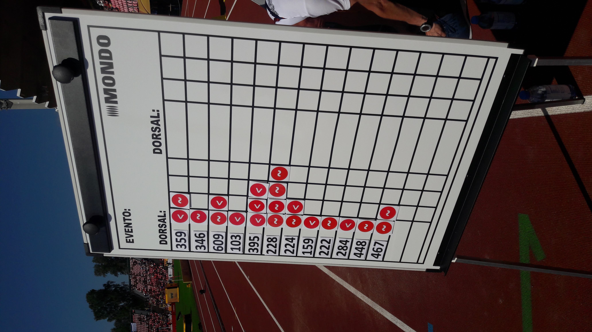{: style="width: 50%"}
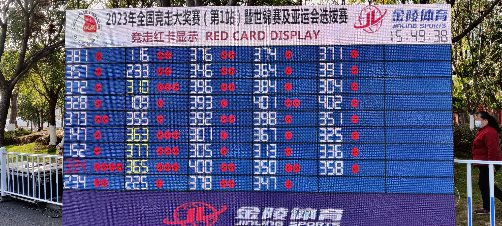

## Maantiereitti

- Reitin pituus 1-2 km
- WA:n A -tai B-mittaajan mittaama (tilastokelpoinen tulos)
- Kääntöpaikat; suositus 7,5 m säde (?)
- Tasainen ( ei kaivoja, korokkeita eikä hiekkaa)
- Riittävän leveä 
    - tilaa varoitustaululle, aikasakkoalueelle, tuomareille, juoma- ja sieniasemille, ajanottajille, kierroslaskijoille, lääkintähuollolle

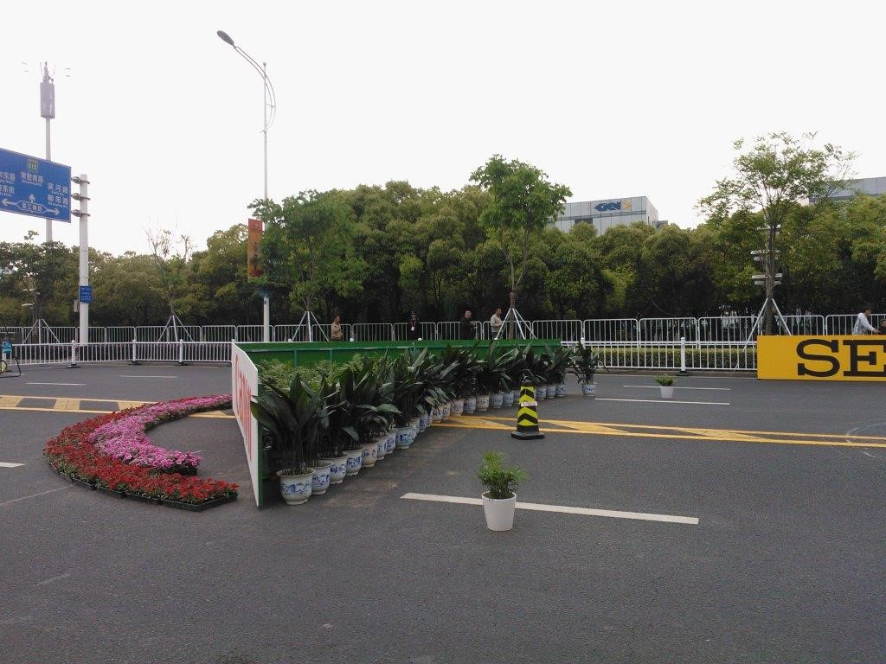

## Juoma, sieni- ja virvokeasemat

- Lähdössä ja maalissa vettä saatavilla
- 5-10 km: vesi- ja sieniasemat
- Yli 10 km: vesi- ja sieniasema sekä virvokeasema
- virvokeasemalla henkilökohtaiset juomat
- valtuutetut henkilöt voivat ojentaa juomat

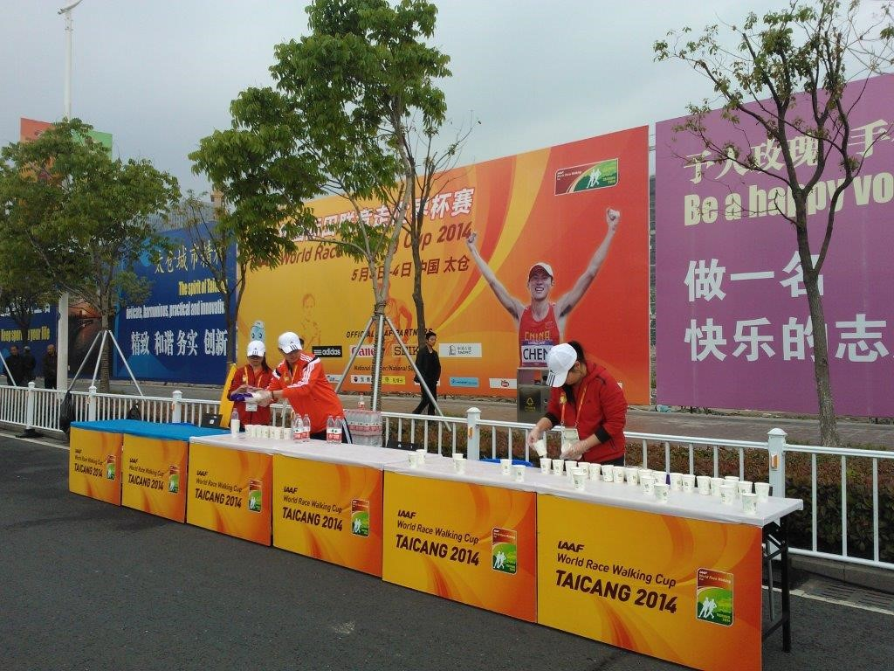
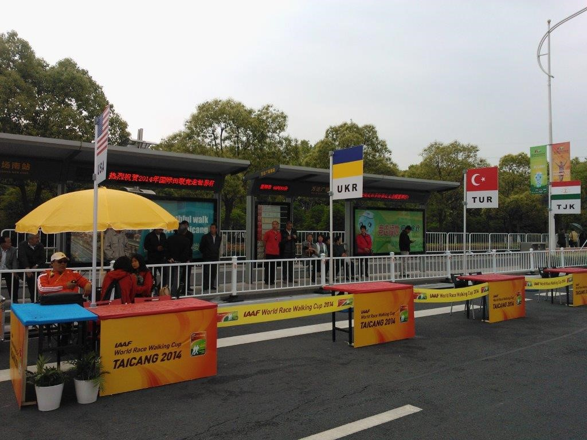

Kilpailijoiden suoritus tulee hylätä, jos hän ottaa virvokkeita muualla kuin virallisella virvokeasemilla.
Hylkäyksen suorittaa lajinjohtaja.
Toimihenkilö ei saa koskaan juosta (tai kävellä) kilpailijan vierellä tämän nauttiessa virvokkeitaan.

Myös radalla suoritettavissa kilpailuissa tulee tarvittaessa käyttää virvokeasemaa. Aseman sijoituspaikka takasuoralla 3-4 radoilla.

## Reitiltä poistuminen

Virallisen toimihenkilön valvonnassa ja  luvalla

Mikäli käveltävää matkaa lyhennetään tai poistutaan luvattomasti reitiltä on kilpailija hylättävä. Hylkäyksen suorittaa lajinjohtaja.

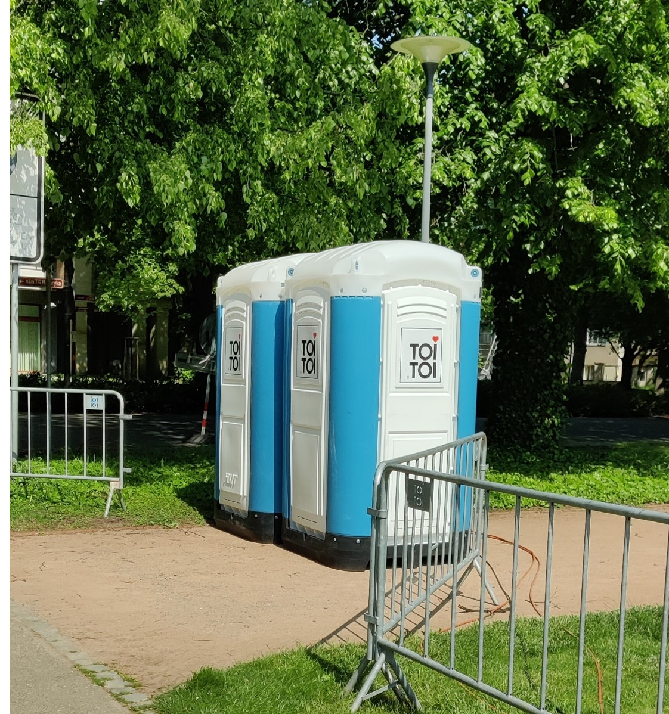

## Turvallisuus kilpailuissa

Kävelykilpailujen järjestäjien on varmistettava kilpailijoiden turvallisuus. 

Reitti tulisi sulkea mahdollisuuksien mukaan muulta liikenteeltä ja minimoida läpikulkuliikenne reitillä.

Reitin varrella oltava riittävästi liikenteen ja reitin valvojia.

Varmistettava myös lääkintähenkilökunnan paikallaolo.

