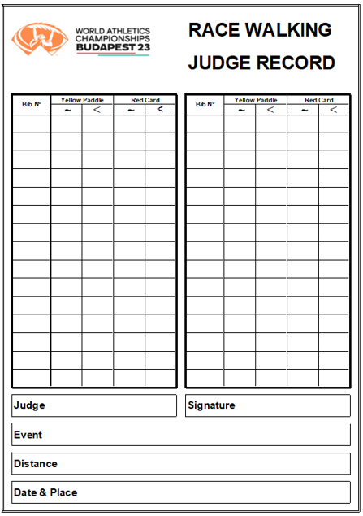

# Tuomitseva tuomari - kertausta

## Sääntökertausta

WA – yleisurheilun säännöt, sääntö TR 54 kilpakävely

### Kilpakävelyn määritelmä TR 54.2

1. Kilpakävely on etenemistä askelia ottaen niin, että kävelijä säilyttää kosketuksen maahan siten, ettei ihmissilmällä havaittavaa kosketuksen irtaantumista esiinny. 
2. Etummaisen jalan täytyy olla suorana (ei taivutettuna polvesta eli ns. ”koukkupolvi”) maakosketuksen alkamishetkestä lähtien siihen asti, kun se on pystysuorassa asennossa.

    
    
    

??? note "Huomautus: Moderni kilpakävelytekniikka"

      1. Hetki, jolloin edellisen askeleen ponnistava jalka irtoaa radan pinnasta “Toe-Off”. Aloittaa uuden yksittäisen askeleen
      2. Lentovaihe: kun molemmat jalat ovat irti radasta yhtä aikaa (Loss-of-Contact tai LOC vaihe)
      3. Kantaisku: hetki, jolloin heilahtava jalka koskettaa radan pintaa
      4. Etutukivaihe: kantaiskusta hetkeen, kun kävelijän massakeskipiste kulkusuuntaan nähden on joko tukipisteen takana tai juuri tulossa tukipisteen päälle
      5. Pystytuki: hetki, jolloin massakeskipiste on tarkalleen tukipisteen päällä
      6. Takatukivaihe: aika, jolloin tukipiste on kävelijän massakeskipisteen takana.
      7. Toe-Off: ponnistava jalka irtoaa radasta. Päättää yksittäisen askeleen (askelsyklin puolikkaan)

    

### Vakiomatkat TR 54.1

- 200m rata: 3000 m, 5000 m 
- 400m rata: 5000 m, 10000 m, 20000 m, 35 000 m, 50 000 m                             
- Maantie: 10 km, 20 km, 35 km ja 50 km

### Huomautukset (keltainen laikka) TR 54.5

- Tuomarin tulisi huomauttaa kilpailijaa, mikäli mahdollista, kun hänen kävelytapansa on tuomarin mielestä sellainen, että se ei täysin täytä säännössä TR54.2 asetettua kilpakävelyn määritelmää.
- Tuomarin huomautus tapahtuu näyttämällä kilpailijalle keltaista laikkaa, jonka kummallakin puolella on kuvattuna rikkomusta osoittava symboli. 
- Kävelijä ei voi saada toista huomautusta samasta rikkomuksesta samalta tuomarilta. 
- Huomautettuaan jotakuta kilpailijaa tuomarin on ilmoitettava toimenpiteestään ylituomarille kilpailun jälkeen. 

### Hylkäysesitykset = varoitukset (punaiset kortit) TR 54.6 

- Tuomarin havaittua, että kilpailijan kävelytapa on missä tahansa kilpailun vaiheessa säännössä TR54.2 annetun määritelmän vastainen joko ihmissilmällä havaittavan kosketuksen irtaantumisen tai "koukkupolven" muodossa, hänen on toimitettava ylituomarille kyseistä kilpailijaa koskeva hylkäysesitys punaisella kortilla (Red Card).

## Toimintaohjeita tuomitsevalle tuomarille

Kävelytuomarit varmistavat, että kaikki kilpailijat suorittavat kilpailun lajin sääntöjen mukaisesti.

Tuomitseva tuomari

- työskentelee itsenäisesti, ja päätöksenteko perustuu omiin näköhavaintoihin (TR54.3.2). 
- ei tuomitse ennakkoasenteiden pohjalta
- noudattaa ylituomarin ohjeita
- ei keskustele yleisön tms. kanssa
- osallistuu ylituomarin valintaan aloituskokouksessa, mikäli ylituomaria ei ole valittu etukäteen (TR54.3.1)

### Huomautukset ja varoitukset

Huomautuksella autat urheilijaa korjaamaan tekniikkansa sääntöjen mukaiseksi.

- Huomauta mahdollisimman varhain
- Huomauta ensin kilpailijaa, jolla on pahin rike
- Kun kirjoitat varoituksen, tarkista, että se on kokonaan ja selkeästi täytetty, ja anna lähetin vietäväksi
- Täytä pöytäkirja jokaisesta huomautuksesta ja varoituksesta

### Huomautuksen näyttäminen

- Kilpailijan lähestyessä tuomari näyttää huomautuksen pitämällä leikkaa hartian korkeudella kilpailijan edessä tai etuviistossa.
- Huomauttamisesta ei saa aiheutua haittaa kilpailijoille.
- Huomautuksen yhteydessä on sanottava kilpailijan numero.
- On hyvä sanoa myös huomautuksen syy, varsinkin nuorten kilpailuissa

{: style="width:50%"}

### Varoituslapun täyttäminen

Kun täytät varoituslappua, on tärkeää täyttää jokainen kohta selkeästi

- Tuomarin numero ja nimi
- Varoituksen syy ja kellonaika
- Kilpailijan numero
- Ja mitä muuta lapussa kysytään

Kilpailussa voi olla käytössä myös elektroninen järjestelmä. Harjoittele sen käyttö hyvin ennen starttia!

### Tuomarin oma pöytäkirja

Tuomari kirjaa henkilökohtaiseen pöytäkirjaan yhden kisan kaikki tapahtumat 

- Huomautukset (keltainen laikka), syy ja kellonaika
- Varoitukset (punainen lappu), syy ja kellonaika

Muista täyttää myös muut tiedot. Anna sihteerille tai ylituomarille kisan lopuksi mahdollisimman pian

### Vaaranpaikat

1. Alkukiihdytys
2. Kääntöpisteet 
3. Ala- ja ylämäet
4. Terävät mutkat
5. Juoma- ja virkistysasemat
6. Joukon keskellä käveleminen
7. Loppukiri

### Tuomitsevan tuomarin kisaohjeet

1. Saavu paikalle viimeistään 45 min ennen kisan alkua, ellei ole muuta ohjeistettu.
2. Osallistu tuomarikokoukseen ennen kisaa.
3. Kisaa ennen sijoitu ajoissa ylituomarin määräämälle alueelle niin, että näet esteettä kävelijöiden jalat. Ratakisassa sijoitu 4. ulkoradoille.
5. Näytä keltaista lätkää mahdollisimman aikaisin, ja kirjaa kaikki tapahtumat.
6. Täytä punainen kortti tarkasti, kirjaa pöytäkirjaan, ja lähetä sihteerille.
7. Loppukiriä varten siirry maalisuoralle, jos niin on sovittu. Muuten pysy alueellasi, kunnes viimeinenkin kilpailija on ohittanut alueesi viimeisen kerran.
8. Osallistu jälkipalaveriin, luovuta pöytäkirjat sihteerille tai ylituomarille, ja osallistu keskusteluun. Kehitytään yhdessä.

